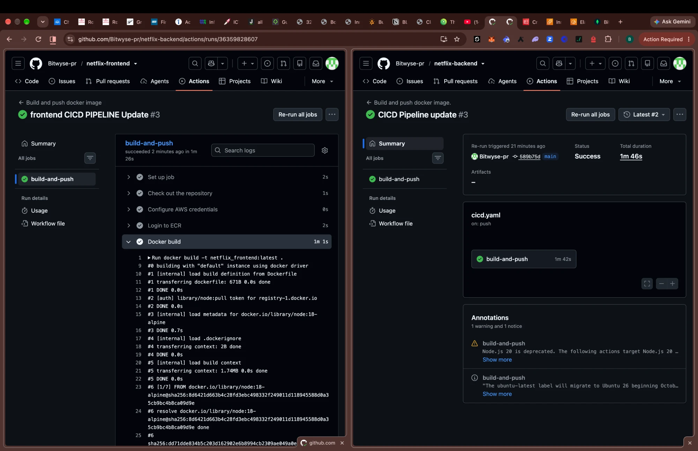
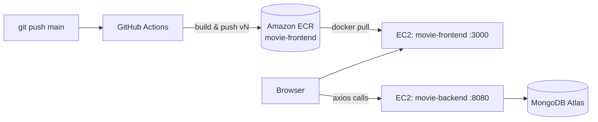

# Netflix Frontend: CI/CD to Amazon ECR and Docker deployment

This is the **React frontend** of a two-tier Netflix-style app. Every push to `main` builds a Docker image with GitHub Actions and pushes it to **Amazon ECR**. An EC2 Docker host pulls the image and runs it, and **Portainer** manages it.

> 📘 The backend (Spring Boot + MongoDB Atlas), the EC2 host setup and the Portainer setup are documented in the backend repo: **[netflix-backend → deployment-docs](https://github.com/Bitwyse-pr/netflix-backend/tree/main/deployment-docs)**

| | |
|---|---|
| **Stack** | React 18, React Router, MUI, React Bootstrap, Axios |
| **Container** | `node:18-alpine`, production build served with `serve` |
| **Image** | `<AWS_ACCOUNT_ID>.dkr.ecr.eu-west-1.amazonaws.com/movie-frontend:v3` |
| **Port** | `3000` |
| **Talks to** | Backend API at `http://<EC2_PUBLIC_IP>:8080/api/v1/movies` |



---

## Why a CI/CD pipeline for a frontend?

- **The same build every time.** `npm install` and `npm run build` run in a clean container on GitHub's runners, not on my laptop.
- **Versioned releases.** Each push produces `movie-frontend:v<run-number>`, and older versions stay in ECR for instant rollback.
- **Nothing to install on the server.** The EC2 host needs Docker, and that's it. No Node or npm required.

---

## How it fits together



The React app runs **in the browser**, so API calls go from the user's browser straight to the backend on port `8080`. They don't go through the frontend container. That's why port 8080 has to be open in the security group as well as 3000.

---

## 1. Dockerfile

```dockerfile
FROM node:18-alpine
WORKDIR /app
COPY package*.json ./
RUN npm install
COPY . .
RUN npm run build
RUN npm install -g serve
EXPOSE 3000
CMD ["serve", "-s", "build", "-l", "3000"]
```

## 2. Backend URL

The API base URL is set in `src/api/axiosConfig.js`:

```js
import axios from 'axios';

export default axios.create({
    baseURL: 'http://<EC2_PUBLIC_IP>:8080',
    headers: { 'Content-Type': 'application/json' },
});
```

## 3. GitHub Actions workflow: `.github/workflows/cicd.yaml`

```yaml
name: Build and push docker image

on:
  push:
    branches: [ main ]

jobs:
  build-and-push:
    runs-on: ubuntu-latest

    permissions:
      contents: read
      id-token: write

    steps:
    - name: Check out the repository
      uses: actions/checkout@v2

    - name: Configure AWS credentials
      uses: aws-actions/configure-aws-credentials@v4
      with:
        aws-access-key-id: ${{ secrets.AWS_ACCESS_KEY_ID }}
        aws-secret-access-key: ${{ secrets.AWS_SECRET_ACCESS_KEY }}
        aws-region: ${{ secrets.AWS_REGION }}

    - name: Login to ECR
      id: login-ecr
      uses: aws-actions/amazon-ecr-login@v2

    - name: Docker build
      run: docker build -t netflix_frontend:latest .

    - name: Docker push
      run: |
        docker tag netflix_frontend:latest <AWS_ACCOUNT_ID>.dkr.ecr.eu-west-1.amazonaws.com/movie-frontend:v${GITHUB_RUN_NUMBER}
        docker push <AWS_ACCOUNT_ID>.dkr.ecr.eu-west-1.amazonaws.com/movie-frontend:v${GITHUB_RUN_NUMBER}
```

### Repository secrets (Settings → Secrets and variables → Actions)

| Secret | Value |
|---|---|
| `AWS_ACCESS_KEY_ID` | IAM user access key with ECR push rights |
| `AWS_SECRET_ACCESS_KEY` | IAM user secret |
| `AWS_REGION` | `eu-west-1` |

## 4. Deploy on the EC2 Docker host

```bash
# Log in to ECR
aws ecr get-login-password --region eu-west-1 \
  | docker login --username AWS --password-stdin <AWS_ACCOUNT_ID>.dkr.ecr.eu-west-1.amazonaws.com

# Pull and run
docker pull <AWS_ACCOUNT_ID>.dkr.ecr.eu-west-1.amazonaws.com/movie-frontend:v3
docker run -d --name movie-frontend --restart=always -p 3000:3000 \
  <AWS_ACCOUNT_ID>.dkr.ecr.eu-west-1.amazonaws.com/movie-frontend:v3

docker ps
```

Open `http://<EC2_PUBLIC_IP>:3000`. The container is also visible and manageable in Portainer at `https://<EC2_PUBLIC_IP>:9443`.

### Rolling out a new version

```bash
docker pull <AWS_ACCOUNT_ID>.dkr.ecr.eu-west-1.amazonaws.com/movie-frontend:v4
docker rm -f movie-frontend
docker run -d --name movie-frontend --restart=always -p 3000:3000 \
  <AWS_ACCOUNT_ID>.dkr.ecr.eu-west-1.amazonaws.com/movie-frontend:v4
```

To roll back, run the same commands with the previous tag.

---

## 5. Errors I hit and how I fixed them

### Error 1: `Input required and not supplied: aws-region`

**What happened:** Runs #1 and #2 failed in seconds at *Configure AWS credentials*.

**Cause:** The frontend repo had no AWS secrets. I had already added them to the **backend** repo, but GitHub secrets are **scoped per repository**, so the frontend couldn't see them.

**Fix:** I added `AWS_ACCESS_KEY_ID`, `AWS_SECRET_ACCESS_KEY` and `AWS_REGION` to this repo too. Run #3 passed and pushed `movie-frontend:v3`.

---

### Error 2: The app loaded but showed no movies

**Cause:** `baseURL` in `src/api/axiosConfig.js` still pointed at the original author's server, so every API call from the browser went to the wrong place.

**Fix:** I changed it to my EC2 public IP on port `8080` (commit *"Backend IP update"*) and pushed, which rebuilt the image.

**Lesson:** Create React App bakes this URL into the JavaScript bundle at **build time**. Changing it on the server does nothing, so you have to rebuild the image. If the EC2 instance is stopped and started, its public IP changes and the frontend breaks. Attach an **Elastic IP**, or better, put the API behind a domain name.

---

### Error 3: VS Code shows `Context access might be invalid: AWS_ACCESS_KEY_ID`


**Cause:** The GitHub Actions VS Code extension can't see the repo's secrets, so it flags every `secrets.*` reference.

**Fix:** None needed. It's an editor warning, not a pipeline error.

---

### Error 4: `no space left on device` when pulling images on EC2

The frontend image is about **1.1 GB** on disk because it keeps all `node_modules` alongside the build. Together with the backend image, that filled the default 8 GiB root volume. I fixed it by growing the EBS volume to 20 GiB, then running `growpart` and `resize2fs`. The full walkthrough with screenshots is in the [backend deployment docs](https://github.com/Bitwyse-pr/netflix-backend/tree/main/deployment-docs#error-6-docker-pull-failed-with-no-space-left-on-device).

---

### Warnings (not failures)

- **`Node.js 20 is deprecated`**: bump `actions/checkout@v2` to `actions/checkout@v4` or later.
- **`node:18` is end-of-life**: move the base image to `node:20-alpine` or `node:22-alpine`.

---

## 6. Improvements I'd make next

- **Multi-stage Dockerfile, serving the static build with Nginx.** This cuts the image from about 1.1 GB to about 50 MB:
  ```dockerfile
  FROM node:22-alpine AS build
  WORKDIR /app
  COPY package*.json ./
  RUN npm ci
  COPY . .
  RUN npm run build

  FROM nginx:alpine
  COPY --from=build /app/build /usr/share/nginx/html
  EXPOSE 80
  ```
- **API URL from the environment.** Read `process.env.REACT_APP_API_URL` in `axiosConfig.js` and pass it as a Docker build arg, so the IP isn't hard-coded in source.
- **Reverse proxy.** Put Nginx in front and route `/api` to the backend. The browser then only talks to one origin over HTTPS, and port 8080 no longer needs to be public.
- **GitHub OIDC** instead of long-lived AWS access keys. The workflow already has `id-token: write`.
- **Automated deploy step** so a push to `main` ends with the new container running.

---

*Built by Bolarinwa David ([@Bitwyse-pr](https://github.com/Bitwyse-pr)). Starter code: DigitalWitch.*
